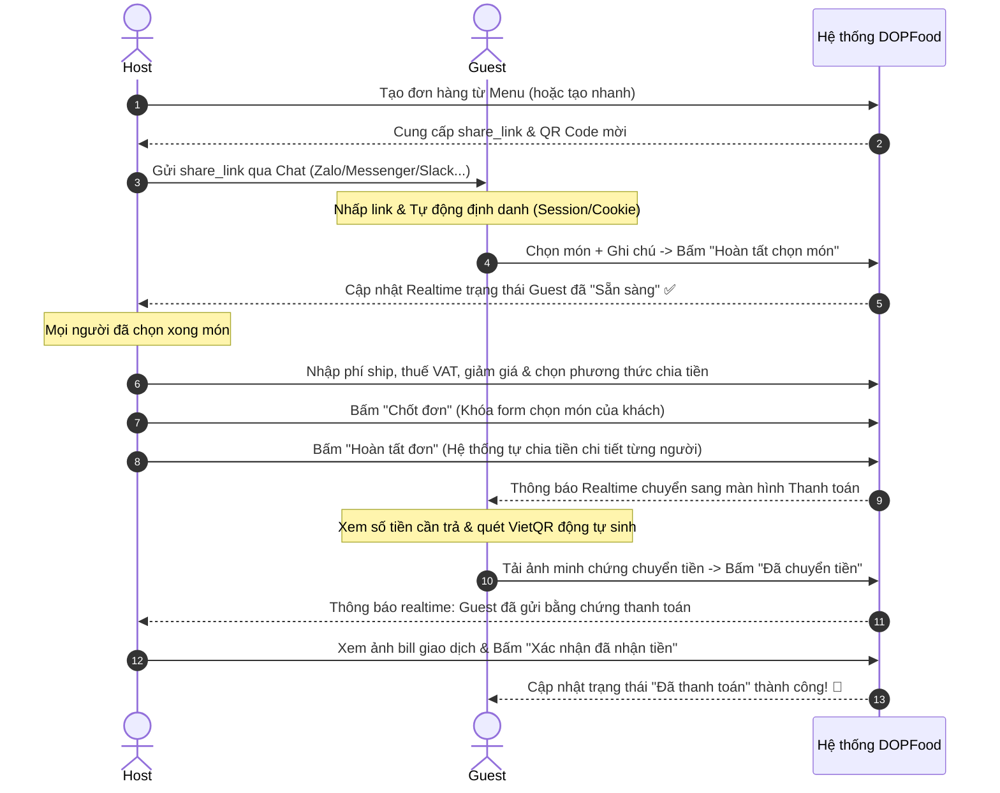

# 🍔 DOPFood - Ứng dụng Đặt món & Chia tiền Nhóm

## 📖 Mô tả dự án
**DOPFood** là một ứng dụng đột phá giúp tối ưu hóa quy trình gọi đồ ăn chung và chia sẻ chi phí hóa đơn (Bill Splitting) cho các nhóm văn phòng, bạn bè hoặc gia đình. Ứng dụng giải quyết triệt để các bài toán thực tế: tạo đơn hàng chung, gom món theo thời gian thực (realtime), tính toán chi phí phức tạp (ship, giảm giá, thuế VAT) và đối soát thanh toán minh bạch bằng mã QR động VietQR.

---

## 🎯 Phân tích & Tối ưu hóa Tính năng (Phase 1)

### 1. Trang chủ (Home Page)
* **Tạo đơn nhanh:** Khởi tạo phiên đặt hàng tức thì. Chọn Menu từ thư viện đã có hoặc tạo nhanh một Menu tạm thời (có tùy chọn "Lưu Menu này vào thư viện").
* **Tạo Menu mới:**
  * Thông tin: Tên nhà hàng/quán ăn, Mô tả ngắn, SĐT, Địa chỉ (Tùy chọn).
  * Danh sách món: Thêm động các món ăn (Hình ảnh món, Tên món, Giá tiền).
* **Thư viện Menu:** Hiển thị danh sách các Menu đã lưu dưới dạng thẻ trực quan. Cho phép tìm kiếm nhanh theo tên quán và click để xem chi tiết hoặc tạo đơn ngay lập tức.

### 2. Trang chi tiết Menu
* Xem danh sách món ăn sinh động thuộc Menu đã chọn.
* **CRUD thực đơn:** Thêm, sửa, xóa thông tin món ăn trực tiếp trước khi mở phiên đặt chung.
* **Hành động:** Nút `Tạo đơn từ Menu này` để lập tức chuyển sang giao diện Order Page.

### 3. Trang Đơn hàng (Order Page - Realtime Core)
**A. Góc nhìn Chủ đơn (Host View):**
* **Mời tham gia:** Copy Link mời nhanh hoặc hiển thị mã QR Code để mọi người quét truy cập trực tiếp.
* **Giám sát Realtime:** Hiển thị danh sách tất cả những người đang truy cập và trạng thái chọn món của họ dưới dạng nhãn trực quan (Đang chọn 💬 hoặc Đã xong ✅).
* **Phí phát sinh & Giảm giá:** Nhập phí giao hàng (Ship), thuế VAT (%), số tiền giảm giá hoặc mã giảm giá (áp dụng giảm tổng bill hoặc giảm trừ theo món ăn).
* **Tùy chọn chia tiền linh hoạt (Bill Splitting):**
  * Không chia (Host bao 100%).
  * Chia đều (Tổng bill sau khi cộng ship/thuế/giảm giá chia đều cho số người).
  * Chia theo món (Tiền món của ai nấy trả + phí ship, thuế và giảm giá được phân bổ theo tỷ lệ giá trị món ăn hoặc chia đều).
* **Hành động:** 
  * `Chốt đơn` (Khóa form để khách không thể thêm/sửa/xóa món ăn nữa).
  * `Hoàn tất đơn` (Chốt hóa đơn cuối cùng và chuyển toàn bộ nhóm sang màn hình Thanh toán).

**B. Góc nhìn Người tham gia (Guest View):**
* **Định danh thông minh:** Nhập Tên và Số điện thoại lần đầu tham gia. Hệ thống lưu phiên bằng Cookie/Session để tự động nhận diện nếu tải lại trang hoặc tham gia đơn khác, không bắt buộc nhập lại.
* **Chọn món:** Xem danh sách món ăn, thêm món vào giỏ hàng cá nhân, tùy chỉnh số lượng và thêm ghi chú chi tiết cho từng món (VD: "Ít đường", "Không hành").
* **Xác nhận đặt:** Nhấn `Hoàn tất chọn món` để chuyển trạng thái sang "Sẵn sàng" (Guest sẽ bị khóa thao tác sửa món để Host dễ kiểm soát tổng đơn).

### 4. 🌟 [BỔ SUNG] Trang Thanh toán & Đối soát (Settlement & Payment Page)
> [!IMPORTANT]
> Đây là trang được bổ sung nhằm hoàn tất vòng lặp trải nghiệm người dùng (End-to-End User Journey), giải quyết triệt để khâu "ngại ngùng" và dễ sai sót nhất khi thu tiền nhóm.
* **Giao diện dành cho Khách (Guest View):**
  * Xem bảng tính chi tiết cá nhân: Giá các món đã chọn + Phần chia phí ship + Phần chia thuế - Phần giảm giá được hưởng = **Tổng số tiền cần trả**.
  * **Mã QR chuyển khoản động (VietQR):** Tự động sinh mã QR ngân hàng dựa trên: *Thông tin ngân hàng của Host + Số tiền chính xác cần trả + Nội dung chuyển khoản định sẵn* (VD: `DOPFOOD DH12 NAMNGUYEN`). Guest chỉ cần mở app ngân hàng quét QR là tiền đi thẳng, chuẩn 100%, không cần gõ STK hay số tiền thủ công.
  * **Gửi bằng chứng:** Nút upload ảnh chụp màn hình giao dịch chuyển khoản thành công.
  * **Trạng thái:** Hiển thị tiến trình trực quan: *Chờ thanh toán ➔ Đã gửi bill chuyển khoản ➔ Đã hoàn tất thanh toán*.
* **Giao diện dành cho Chủ đơn (Host View):**
  * **Bảng đối soát Realtime:** Xem danh sách toàn bộ Guest tham gia, số tiền mỗi người cần trả, và trạng thái thanh toán hiện tại của họ.
  * **Duyệt bill chuyển khoản:** Click xem trực tiếp ảnh chụp bill giao dịch mà Guest tải lên.
  * **Xác nhận nhanh:** Bấm nút "Xác nhận đã nhận tiền" để chuyển trạng thái của Guest sang "Đã thanh toán" ngay lập tức.
  * **Thống kê thu tiền:** Thanh tiến độ hiển thị trực quan (VD: *Đã thu: 250k / 320k - Còn thiếu 2 người*).

### 5. 🌟 [BỔ SUNG] Trang Cấu hình Thanh toán Host (Host Wallet/Bank Settings)
* Giúp Host thiết lập thông tin nhận tiền một lần duy nhất để phục vụ sinh mã QR động VietQR:
  * Chọn Ngân hàng nhận (tích hợp danh sách hơn 50 ngân hàng Việt Nam thuộc hệ thống Napas).
  * Nhập Số tài khoản ngân hàng.
  * Nhập Tên chủ tài khoản (In hoa không dấu).
  * *Cơ chế hoạt động:* Lưu trữ tại LocalStorage trên trình duyệt của Host (nếu không đăng nhập) hoặc lưu vào Database (nếu Host đã đăng ký tài khoản). Khi Host tạo đơn hàng mới, thông tin này sẽ được áp dụng tự động.

### 6. Trang Lịch sử Đơn hàng & Dashboard
* **Lịch sử đặt:** Danh sách các đơn hàng Host đã tạo hoặc Guest đã tham gia (Tên quán, ngày đặt, tổng tiền, vai trò Host/Guest, trạng thái đơn).
* **Chi tiết đơn cũ:** Xem lại chi tiết hóa đơn, phương thức chia tiền, ai đã gọi món gì, ai đã thanh toán như thế nào.
* **🌟 Thống kê tài chính cá nhân (Dashboard):** 
  * Biểu đồ chi tiêu theo tuần/tháng.
  * Top món ăn và nhà hàng được đặt nhiều nhất.
  * Thống kê công nợ (Host: ai đang nợ mình bao nhiêu tiền; Guest: mình đang nợ Host nào từ các phiên đặt trước).

---

## 🔄 Luồng Tương tác Tối ưu (Optimized User Flows)

---

## 🗄️ Cấu trúc Database Tối ưu (Schema)

Dưới đây là thiết kế Database đã được tối ưu hóa đồng bộ với các tính năng đề xuất ở trên, giải quyết triệt để khâu lưu trữ ngân hàng của Host, bằng chứng thanh toán của Guest, thông tin thuế VAT, trạng thái đặt món thời gian thực và timestamps cho mọi bảng.

### 1. Bảng `users` (Tài khoản người dùng đăng ký)
| Cột | Kiểu | Ghi chú |
| :--- | :--- | :--- |
| `id` | PK, INT, AUTO_INCREMENT | Khóa chính |
| `name` | VARCHAR(100) | Tên hiển thị người dùng |
| `phone` | VARCHAR(15) | Số điện thoại |
| `email` | VARCHAR(100), UNIQUE | Email đăng nhập |
| `bank_name` | VARCHAR(50) | Tên viết tắt ngân hàng nhận tiền mặc định (VD: MBBank, VCB) |
| `bank_account_number` | VARCHAR(30) | Số tài khoản ngân hàng mặc định |
| `bank_account_name` | VARCHAR(100) | Tên chủ tài khoản mặc định |
| `created_at` | TIMESTAMP | Thời gian tạo tài khoản |
| `updated_at` | TIMESTAMP | Thời gian cập nhật tài khoản |

### 2. Bảng `menus` (Thư viện thực đơn)
| Cột | Kiểu | Ghi chú |
| :--- | :--- | :--- |
| `id` | PK, INT, AUTO_INCREMENT | Khóa chính |
| `name` | VARCHAR(150) | Tên Menu hoặc Tên Quán ăn |
| `description` | TEXT | Mô tả ngắn về thực đơn / quán ăn |
| `phone` | VARCHAR(15) | SĐT Quán ăn |
| `address` | TEXT | Địa chỉ Quán ăn |
| `is_temp` | BOOLEAN | `true` nếu là menu được tạo nhanh, không lưu vĩnh viễn |
| `created_at` | TIMESTAMP | |
| `updated_at` | TIMESTAMP | |

### 3. Bảng `menu_items` (Món ăn chi tiết)
| Cột | Kiểu | Ghi chú |
| :--- | :--- | :--- |
| `id` | PK, INT, AUTO_INCREMENT | Khóa chính |
| `menu_id` | FK, INT | Liên kết ngoại tới `menus(id)` |
| `name` | VARCHAR(150) | Tên món ăn |
| `price` | DECIMAL(12,2) | Giá gốc của món ăn |
| `image_url` | VARCHAR(255) | Link hình ảnh mô tả món ăn |
| `created_at` | TIMESTAMP | |
| `updated_at` | TIMESTAMP | |

### 4. Bảng `orders` (Quản lý phiên đặt hàng chung)
| Cột | Kiểu | Ghi chú |
| :--- | :--- | :--- |
| `id` | PK, INT, AUTO_INCREMENT | Khóa chính |
| `host_id` | FK, INT, NULL | Liên kết tới `users(id)` (có thể NULL nếu Host không đăng nhập) |
| `menu_id` | FK, INT | Liên kết tới `menus(id)` |
| `status` | ENUM | Trạng thái phiên: `ordering` (đang chọn món), `locked` (đã khóa chọn món), `completed` (hoàn tất đơn, chờ thanh toán), `closed` (đã thu đủ tiền & đóng phiên) |
| `split_type` | ENUM | Phương thức chia tiền: `none` (Host bao), `even` (chia đều), `individual` (chia theo món) |
| `shipping_fee` | DECIMAL(12,2) | Phí giao hàng thực tế |
| `tax_amount` | DECIMAL(12,2) | Số tiền thuế VAT phát sinh (đồng bộ với mô tả) |
| `discount_amount`| DECIMAL(12,2) | Số tiền giảm giá được áp dụng |
| `total_amount` | DECIMAL(12,2) | Tổng số tiền cần thanh toán cho toàn bộ đơn hàng |
| `share_link` | VARCHAR(100), UNIQUE | Mã định danh UUID/Hash cho link chia sẻ mời đặt chung |
| `bank_name` | VARCHAR(50) | Lưu thông tin ngân hàng nhận tiền của Host tại thời điểm tạo đơn |
| `bank_account_number` | VARCHAR(30) | Tránh trường hợp Host đổi cấu hình ngân hàng mặc định |
| `bank_account_name` | VARCHAR(100) | Vẫn giữ được tính chính xác cho các đơn hàng cũ |
| `created_at` | TIMESTAMP | Thời điểm mở phiên đặt hàng |
| `updated_at` | TIMESTAMP | Thời điểm cập nhật trạng thái đơn hàng |

### 5. Bảng `order_participants` (Danh sách thành viên tham gia gom đơn)
| Cột | Kiểu | Ghi chú |
| :--- | :--- | :--- |
| `id` | PK, INT, AUTO_INCREMENT | Khóa chính |
| `order_id` | FK, INT | Liên kết tới `orders(id)` |
| `guest_name` | VARCHAR(100) | Tên của thành viên tham gia (do họ tự nhập hoặc lấy từ user profile) |
| `guest_phone` | VARCHAR(15) | Số điện thoại thành viên tham gia |
| `session_token` | VARCHAR(100) | Token định danh cookie trình duyệt giúp giữ phiên làm việc |
| `status` | ENUM | Trạng thái đặt: `ordering` (đang chọn), `ready` (đã xong, sẵn sàng chờ Host chốt) |
| `total_share` | DECIMAL(12,2) | Số tiền chính xác người này phải thanh toán sau khi chia hóa đơn |
| `payment_status` | ENUM | Trạng thái thanh toán: `pending` (chờ thanh toán), `submitted` (đã chuyển & gửi ảnh bill), `approved` (Host đã kiểm tra & xác nhận nhận tiền) |
| `payment_evidence_url`| VARCHAR(255) | Đường dẫn hình ảnh bill chuyển khoản do thành viên tải lên |
| `created_at` | TIMESTAMP | Thời điểm thành viên tham gia đơn hàng |
| `updated_at` | TIMESTAMP | Thời điểm thay đổi trạng thái chọn món / thanh toán |

### 6. Bảng `order_items` (Món ăn được chọn chi tiết trong phiên)
| Cột | Kiểu | Ghi chú |
| :--- | :--- | :--- |
| `id` | PK, INT, AUTO_INCREMENT | Khóa chính |
| `order_id` | FK, INT | Liên kết ngoại tới `orders(id)` |
| `participant_id` | FK, INT | Liên kết ngoại tới `order_participants(id)` |
| `menu_item_id` | FK, INT | Liên kết ngoại tới `menu_items(id)` |
| `quantity` | INT | Số lượng món ăn |
| `price_at_order`| DECIMAL(12,2) | Giá món tại thời điểm đặt (tránh sai sót khi menu cập nhật giá sau này) |
| `note` | TEXT | Ghi chú chi tiết cho món ăn (VD: "Không hành", "Nhiều đá") |
| `created_at` | TIMESTAMP | |
| `updated_at` | TIMESTAMP | |